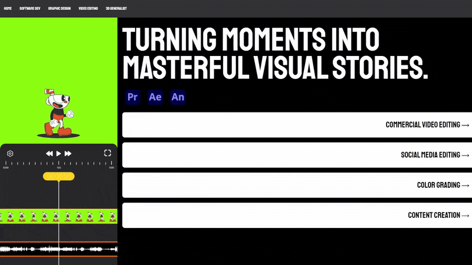
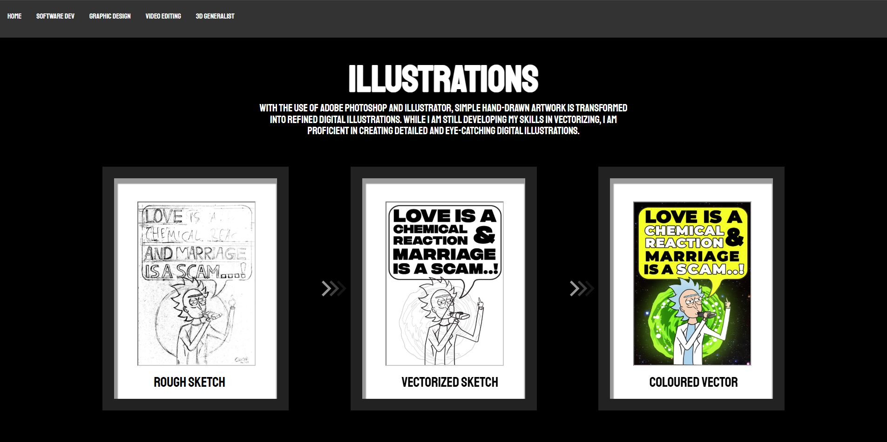

# Personal Portfolio Website
This project is a portfolio site built using HTML, CSS, and JavaScript. It showcases my skills, projects, and contact information in an elegant and user-friendly design.

<br>
<p align="center">
  
</p>
<br>

## 📌 Features

- **Home Page** – A welcoming introduction.  
- **About Me Page** – Brief details about my skills and experience.  
- **Services Page** – Showcasing the services I offer.  
- **Contact Page** – A section to reach out to me.
- **Individual pages for services** – 4 pages describing servies and showcasing gallery.

## 📷 Snapshots

### 🎥 Video Editing
<p align="center">
  
</p>

### 🎨 Graphic Design
<p align="center">
  
  
</p>

### 🎮 3D Generalist
<p align="center">
  
  
  
</p>


## 📁 File Structure

```
/portfolio-website
│── /css
    │── 3DgeneralistStyles.css
    │── FristPageStyles.css
    │── GraphicDstyles.css
    │── SwDevStyles.css
    │── VidEditing.css

│── /images
    │── /Services
        │── /3Dgeneralist
        │── /FirstPage
        │── /GraphicDesign
        │── /SoftwareDev
        │── /VideoEditing

│── 3dGeneralist.html   
│── FirstPage.html   
│── GraphicDesign.html 
│── Readme.md  
│── SoftwareDev.html  
│── VideoEditing.html  
```


## ⚙ Technologies Used

- **HTML** – Structure of the website.  
- **CSS** – Styling and layout.  
- **JavaScript** – Interactive elements.  


## 🚀 Getting Started

1. Clone the repository:  
   ```sh
   git clone https://github.com/your-username/your-repo-name.git](https://github.com/CaeseR112/Personal_Portfolio_Website.git
   ```
2. Open the `index.html` file in a browser.  
